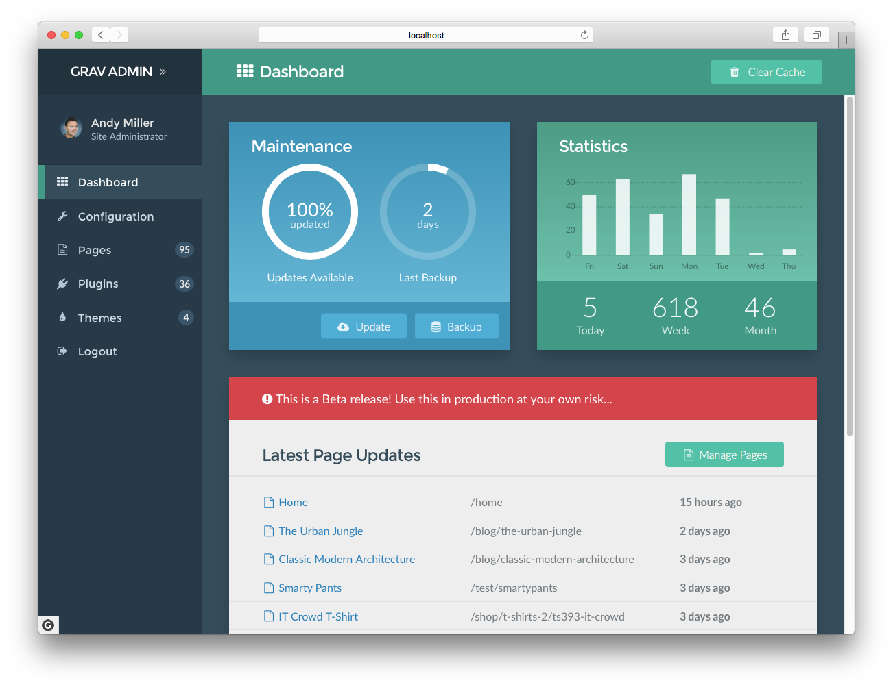

# Grav Standard Administration Panel Plugin

[](https://gitter.im/getgrav/grav-plugin-admin?utm_source=badge&utm_medium=badge&utm_campaign=pr-badge&utm_content=badge)

This **admin plugin** for [Grav](http://github.com/getgrav/grav) is an HTML user interface that provides a convenient way to configure Grav and easily create and modify pages.  This will remain a totally optional plugin, and is not in any way required or needed to use Grav effectively.  In fact, the admin provides an intentionally limited view to ensure it remains easy to use and not overwhelming.  I'm sure power users will still prefer to work with the configuration files directly.

> IMPORTANT!!! This plugin is currently in development as is to be considered a **beta release**.  As such, use this in a production environment **at your own risk!**.



# Features

* User login with automatic password encryption
* Forgot password functionality
* Logged-in-user management
* One click Grav core updates
* Dashboard with maintenance status, site activity and latest page updates
* Ajax-powered backup capability
* Ajax-powered clear-cache capability
* System configuration management
* Site configuration management
* Normal and Expert modes which allow editing via forms or YAML
* Page listing with filtering and search
* Page creation, editing, moving, copying, and deleting
* Powerful syntax highlighting code editor with instant Grav-powered preview
* Editor features, hot keys, toolbar, and distraction-free fullscreen mode
* Drag-n-drop upload of page media files including drag-n-drop placement in the editor
* One click theme and plugin updates
* Plugin manager that allows listing and configuration of installed plugins
* Theme manager that allows listing and configuration of installed themes
* GPM-powered installation of new plugins and themes

# Support

#### Support

We have tested internally, but we hope to use this public beta phase to identify, isolate, and fix issues related to the plugin to ensure it is as solid and reliable as possible.

For **live chatting**, please use the dedicated [Gitter Chat Room for the admin plugin](https://gitter.im/getgrav/grav-plugin-admin) for discussions directly related to the admin plugin.

For **bugs, features, improvements**, please ensure you [create issues in the admin plugin GitHub repository](https://github.com/getgrav/grav-plugin-admin).

# Installation

First ensure you are running the latest **Grav 0.9.34 or later**.  This is required for the admin plugin to run properly (`-f` forces a refresh of the GPM index).

```
$ bin/gpm selfupgrade -f
```

The admin plugin actually requires the help of 3 other plugins, so to get the admin plugin to work you first need to install **admin**, **login**, **forms**, and **email** plugins.  These are available via GPM, and because the plugin has dependencies you just need to proceed and install the admin plugin, and agree when prompted to install the others:

```
$ bin/gpm install admin
```

### Manual Installation

Manual installation is not the recommended method of installation, however, it is still possible to install the admin plugin manually. Basically, you need to download each of the following plugins individually:

* [admin](https://github.com/getgrav/grav-plugin-admin/archive/develop.zip)
* [login](https://github.com/getgrav/grav-plugin-login/archive/develop.zip)
* [form](https://github.com/getgrav/grav-plugin-form/archive/develop.zip)
* [email](https://github.com/getgrav/grav-plugin-email/archive/develop.zip)

Extract each archive file into your `user/plugins` folder, then ensure the folders are renamed to just `admin/`, `login/`, `form/`, and `email/`.  Then proceed with the **Usage instructions below**.

# Usage

Upon completion of the installation the next thing you need to do is create a user account in a file called `user/accounts/admin.yaml`. This **filename** is actually the **username** that you will use to login. The contents will contain the other information for the user.

```
password: 'password'
email: 'youremail@mail.com'
fullname: 'Johnny Appleseed'
title: 'Site Administrator'
access:
  admin:
    login: true
    super: true
```

Of course you should edit your `email`, `password`, `fullname`, and `title` to suit your needs.

> You can use any password when you manually put it in this `.yaml` file.  However, when you change your password in the admin, it must contain at least one number and one uppercase and lowercase letter, and at least 8 or more characters.

By default, you can access the admin by pointing your browser to `http://yoursite.com/admin`. You can simply log in with the `username` and `password` set in the YAML file you configured earlier.

> After logging in, your **plaintext password** will be removed and replaced by an **encrypted** one.

# Standard Free & Paid Pro Versions

If you have been following the [blog](http://getgrav.org/blog), [Twitter](https://twitter.com/getgrav), [gitter.im chat](https://gitter.im/getgrav/grav), etc., you probably already know now that our intention is to provide two versions of this plugin.

The **standard free version**, is very powerful, and has more functionality than most commercial flat-file CMS systems.

We also intend to release in the near future a more feature-rich **pro version** that will include enhanced functionality, as well as some additional nice-to-have capabilities. This pro version will be a **paid** plugin the price of which is not yet 100% finalized.

