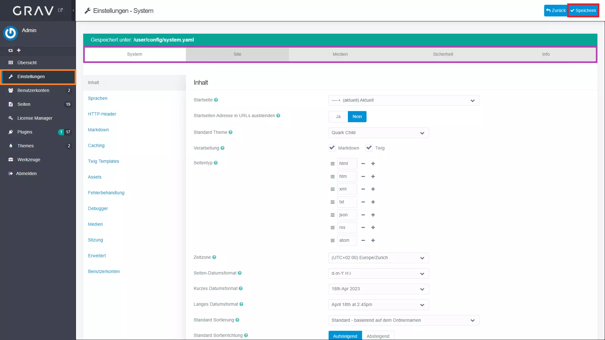

## Einstellungen Tutorial

!!! Hier lernst du, wie du die Einstellungen von Grav anpassen kannst.

1. Melde dich im Admin Panel an
2. Navigiere zu den Einstellungen (orange markiert)
3. Nun solltest du folgende Seite sehen:

4. In der oberen Leiste findest du die verschiedenen [Einstellungskategorien](#categories) (violett markiert)
5. Tätige die gewünschten Änderungen
6. Klicke auf den Speichern Knopf oben rechts (rot markiert)

### Einstellungskategorien {#categories}

Es gibt folgende Einstellungskategorien:

- [System](#system)
- [Site](#site)
- [Medien](#media)
- [Sicherheit](#security)
- [Info](#info)

#### System {#system}

In der Systemeinstellungskategorie findest du Einstellungen, die das System betreffen. Dies betrifft unter anderem die Sprache, die Zeitzone, das Theme, die Caching Einstellungen und weitere.

Diese Einstellungen sind für die meisten Benutzer nicht relevant, da sie nur selten geändert werden müssen.

#### Site {#site}

Diese Einstellungskategorie beinhaltet Einstellungen, die die Seite direkt betreffen. Dazu gehören insbesondere die Seitentitel, die Beschreibung, die Keywords, die URL, Website Sprache, ...

Dies sind die wichtigsten Einstellungen, die du ändern musst, um deine Seite anzupassen und zu personalisieren.

#### Medien {#media}

In dieser Einstellungskategorie sind alle Medientypen aufgelistet, die du in deiner Seite verwenden kannst. Du kannst hier die Dateiendungen, die MIME-Typen und weitere Optionen für jeden Medientyp einstellen.

#### Sicherheit {#security}

Hier befinden sich Einstellungen, die die Sicherheit der Seite betreffen. Hier wird auch festgelegt, welche Dateien und HTML Tags gesperrt sind.

#### Info {#info}

Auf dieser Seite findest du alle Informationen über PHP und die PHP Erweiterungen, die auf deinem Server installiert sind.
