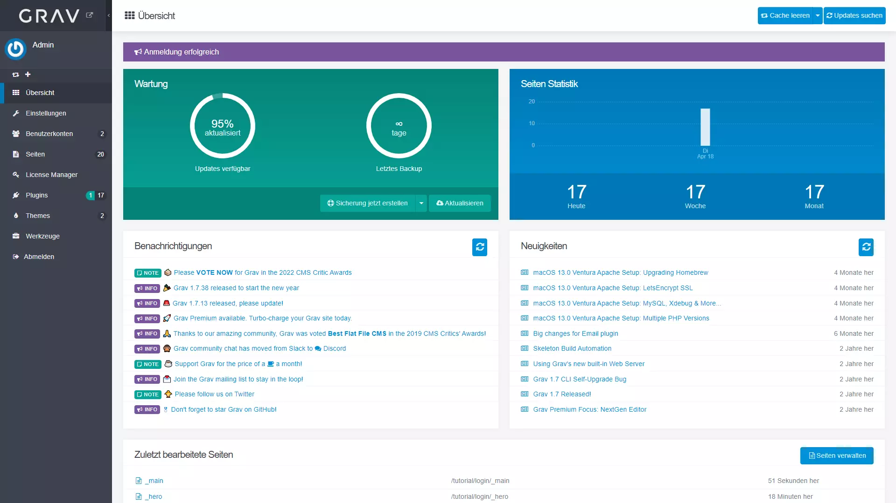

## Dashboard Tutorial

!!! Hier erfährst du, was du auf dem Dashboard sehen kannst und welche Informationen du dort findest.

1. Melde dich im Admin Panel an
2. Nun solltest du das Dashboard sehen:

### Wartung

Auf der linken Seite des Dashboards (grün) findest du die Wartungsoptionen. Hier erkennst du, ob es Updates für Grav oder Plugins gibt und wann das letzte Backup erstellt wurde.

Du kannst auch ein Backup erstellen, indem du auf den Knopf «Backup erstellen» klickst. Ebenfalls kannst du das System aktualisieren, indem du auf den Knopf «Aktualisieren» klickst.

### Seiten Statistik

Auf der rechten Seite des Dashboards (blau) findest du die Seiten Statistik. Hier siehst du, wie oft die Seiten heute, diese Woche und diesen Monat aufgerufen wurden.

### Benachrichtigungen & Neuigkeiten

In der Mitte siehst du die Benachrichtigungen und Neuigkeiten von Grav CMS. Diese können ignoriert werden.

### Zuletzt bearbeitete Seiten

Unten siehst du die zuletzt bearbeiteten Seiten. Hier kannst du auf die Seiten zugreifen, die zuletzt bearbeitet wurden.
