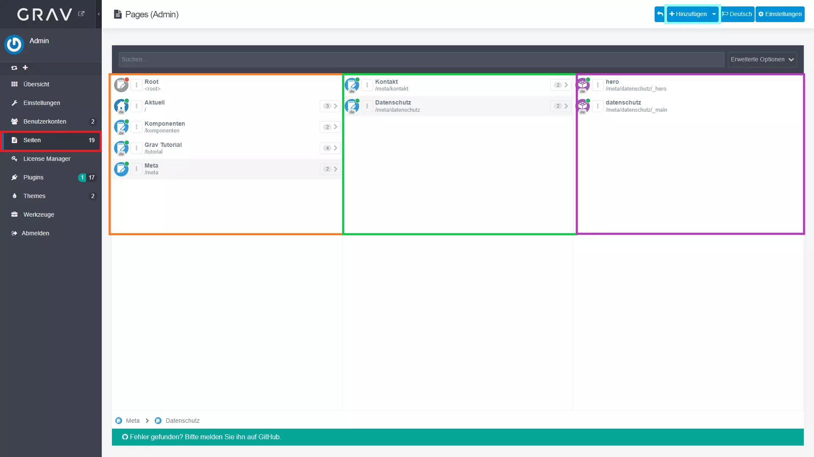
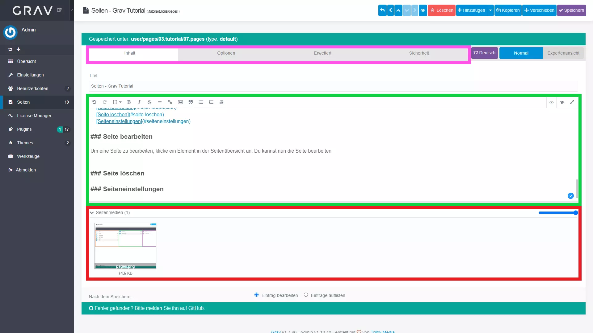
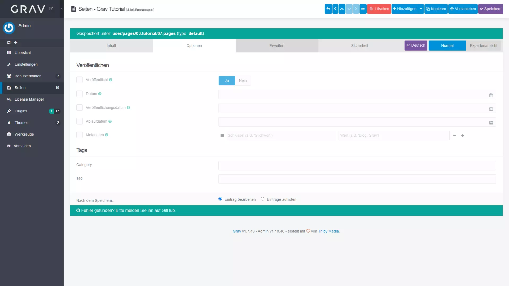
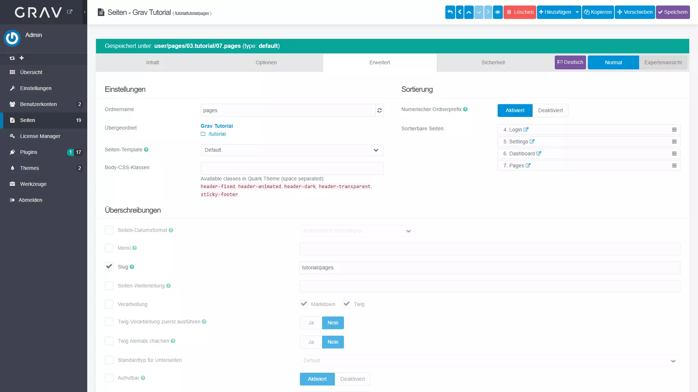

## Seiten Tutorial

!!! Hier erfährst du, wie du Seiten erstellst, bearbeitest und löscht. Zudem erfährst du noch, welche Einstellungen du für Seiten vornehmen kannst.

1. Navigiere zu den Seiten (rot markiert)
2. Du solltest nun die Seiten sehen:

### Übersicht

In der linken Spalte (orange markiert) befinden sich alle Seiten und Ordner auf 1. Ebene.

In der mittleren Spalte (grün markiert) findest du die Seiten und Ordner auf 2. Ebene.

In der rechten Spalte (violett markiert) findest du die Seiten und Ordner auf 3. Ebene.

Oben rechts (türkis markiert) kannst du eine Seite, einen Ordner oder ein Modul erstellen.

#### Aktionen

Die mit einem Haus markierte Seite ist die Startseite. Blaue Symbole mit einem Dokument und einem Stift sind Seiten. Violette Symbole mit einem Baustein sind Module.

Wenn ein grüner Punkt angezeigt wird, bedeutet dies, dass die Seite veröffentlicht ist. Wenn ein roter Punkt angezeigt wird, bedeutet dies, dass die Seite nicht veröffentlicht ist.

Um das Element zu öffnen, klicke darauf. Um Optionen zu öffnen, klicke auf die drei Punkte. Um die untergeordneten Elemente zu öffnen, klicke auf den Pfeil rechts neben dem Element. Danach kannst du zur nächsten Ebene navigieren.

In den Optionen kannst du die Seite bearbeiten, duplizieren und löschen. Zudem kannst du eine Vorschau der Seite öffnen.

### Seite erstellen {#create-page}

Du kannst eine neue Seite erstellen, indem du entweder den Knopf «Neue Seite erstellen» drückst oder eine Seite duplizierst. Dann musst du folgende Angaben machen:

- `Seitentitel*`: Name der Seite
- `Ordnername*`: Name des Ordners, in dem die Seite erstellt werden soll
- `Übergeordnete Seite`: Übergeordnete Seite, in der die Seite erstellt werden soll
- `Seiten Template`: Template, das für die Seite verwendet werden soll
- `Veröffentlicht/Sichtbar*`: Ob die Seite veröffentlicht sein soll oder nicht

[size=20]mit `*` gekennzeichnete Angaben sind auszufüllen[/size]

Weitere Schritte:

- [Seite bearbeiten](#seite-bearbeiten)
- [Seiteneinstellungen](#seiteneinstellungen)

### Seite bearbeiten {#edit-page}

Um eine Seite zu bearbeiten, klicke ein Element in der Seitenübersicht an. Du kannst nun die Seite bearbeiten.

In der Navigation oben (pink markiert) kannst du zwischen Inhalt und verschiedenen Optionen wechseln.

In der Mitte (grün markiert) kannst du den Inhalt der Seite bearbeiten. Am oberen Rand des Feldes hast du Formatierungsoptionen zur Verfügung, um Text entsprechend zu formatieren. Andernfalls kannst du auch Markdown verwenden. Die Formatierungsoptionen/ Komponenten findest du [hier](/komponenten).  
Um eine grobe Vorschau der Seite zu sehen, klicke auf das Auge oben links.

Zu unterst (rot markiert) kannst du Bilder, Videos und andere Medien hochladen.

### Seite löschen {#delete-page}

Um eine Seite zu löschen, klicke auf die drei Punkte neben dem Element in der Seitenübersicht. Klicke dann auf «Löschen». Du wirst gefragt, ob du die Seite wirklich löschen möchtest. Klicke auf «Löschen».

!! Änderungen können nicht rückgängig gemacht werden.

### Seiteneinstellungen {#page-settings}

Es gibt verschiedene Einstellungen, die du für ein Element vornehmen kannst.

#### Optionen

In den Optionen findest du gängige Einstellungen, die du für eine Seite vornehmen kannst. Diese sind:

| Option                   | Beschreibung                                                       |
|:------------------------ |:------------------------------------------------------------------ |
| `Veröffentlicht`         | Ob die Seite veröffentlicht sein soll oder nicht                   |
| `Datum`                  | Datum, mit dem die Seite versehen ist                              |
| `Veröffentlichungsdatum` | Datum, ab dem die Seite automatisch veröffentlicht wird            |
| `Ablaufdatum`            | Datum, ab dem die Seite automatisch nicht mehr veröffentlicht wird |
| `Metadaten`              | Metadaten, die für die Seite verwendet werden sollen               |
| `Category`               | Kategorie, die für die Seite verwendet werden soll                 |
| `Tags`                   | Tags, die für die Seite verwendet werden sollen                    |

#### Erweiterte Optionen

| Option                   | Beschreibung                                                    |
|:------------------------ |:--------------------------------------------------------------- |
| `Ordnername`             | Name des Ordners, in dem die Seite erstellt werden soll         |
| `Numerischer Präfix`     | Numerischer Präfix, der für den Ordner verwendet werden soll    |
| `Sortierung`             | Sortierung, die verwendet werden soll                           |
| `Übergeordnet`           | Übergeordnete Seite, in der die Seite erstellt werden soll      |
| `Seiten Template`        | Template, das für die Seite verwendet werden soll               |
| `Body CSS Klassen`       | CSS-Klassen, die für den Body der Seite verwendet werden sollen |
| `Slug`                   | URL, an der die Seite erreichbar sein soll                      |

Die weiteren Optionen sind nicht relevant für die meisten Benutzer.

### Module {#modules}

Module sind Elemente, die du auf einer Seite einfügen kannst. Dies sind zum Beispiel das Hero-Modul (Teaser Bild mit Überschrift) und das Main-Modul (Hauptteil). Die Reihenfolge der Module kannst du in den Einstellungen der Seite ändern.

Module funktionieren grundsätzlich wie normale Seiten, was die Bearbeitung und die Optionen und Aktionsmöglichkeiten betrifft.

Sie können verwendet werden, um auf einer Seite verschiedene Komponenten oder Abschnitte zu erstellen. Sie sind auch praktisch, wenn man temporär Inhalte auf einer Seite ausblenden möchte, ohne sie zu löschen. Danach kann man diese wieder einblenden.
