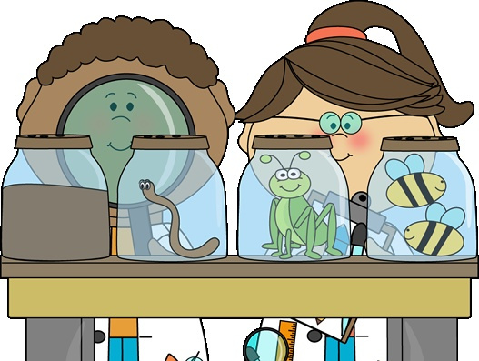

## Purpose

The methods section summarizes what you did to produce the analyzed data that will be presented in the results.  
It has two main purposes.

1.  It should give the audience the information needed for them to fully understand how your study was conducted.
2.  It should give enough information that a scientist, with a background similar to yours, could repeat what you have done.

_Do not be mislead by purpose 2_. The methods section should not be written as a protocol (i.e. a list of steps to be followed by the reader). It is a description of what you did.

## What to include

### Do I need to describe my methods at all?

Some instructors will allow you to simply reference your lab manual for the methods section ("all methods are described in &hellip;"). If this is your situation, you can stop reading now and move on.  
Other instructors will require you to describe all your methods. This is more work but a very good learning experience. You will need to read on.

In primary literature, you will actually find a combination of these two strategies. Where possible, authors will reference already published protocols ("enzyme assays were conducted as described in &hellip;"), and will only describe details of methods that were unique to their study. You will never find a case in the literature where an author simply says "we did everything the same way as author X".

### Level of detail to include

Deciding what level of detail to include will require you to think critically about what you did and what you are presenting in the results. For each method you used, you will need to make some judgements as to what details must be described. Generally, include details that a scientist with your background could not be expected to know. Do not include details that are not likely to have influenced the results.

For example, let's say you are describing an enzyme assay. You could reasonably expect that a scientist with your background will know which pipette to use and how to use it.  
However, you couldn't expect them to have the slightest clue what was in the buffer you used or how you incubated the sample.  

It would be silly to explain how you labeled your tubes. Clearly, if you have collected data from multiple trials, you must kept track of the reactions.

## Strategy

Most people write this section first, and write it while the details are still fresh in their mind. It is an easy section to write, and helps you get over "writer's block".

### Organize the methods

Most novice writers make the mistake of simply trying to describe the study in chronological order. This rarely works because it leads to repetition of methods that were used repeatedly and an overemphasis on timing. Frequently your lab report will describe a study that was conducted over multiple laboratory sessions. However, this timing may not have been necessary for the study but rather an artifact of the weekly 3 h laboratory session. Do not structure your methods around artificial timing.

* Start by making a list of all the methods you used during your study; remember to include the methods used to **analyze the data** (Any data manipulation you did in order to identify trends in the data. E.g. statistical analysis).

!!! Note that you may have used the same protocol multiple times during the study, but you **describe it only once**.

* Create subtitles for the methods section that will allow you to keep related methods together and to describe each method only once.

#### Example

Let's say you assayed the activity of the enzyme funkiase that you isolated from bean plants of various ages (1 day, 3 days, and 5 days old). As each plant reached the testing age, you harvested the appropriate tissue and extracted the enzyme. You then conducted the enzyme assay. You could organize the methods like this:

  

    
  

  

    
<strong>Day 1</strong> 
	Description of how to harvest bean tissue, extract funkiase and carry out the assay.

	
<strong>Day 2</strong> 
	Description of how to harvest bean tissue, extract funkiase and carry out the assay.

	
<strong>Day 3</strong> 
	Description of how to harvest bean tissue, extract funkiase and carry out the assay.

  

As you can see, this organization will require you to describe the exact same methods 3 separate times. A better option:

  

    
  

  

	
<strong>Harvesting bean tissue and isolation of funkiase</strong> Description of how to harvest the plant tissue and extract the enzyme.

	
<strong>Funkiase assay</strong> Description of the assay 

  

If you isolated multiple enzymes from the same tissues, you might want to describe tissue isolation in its own subsection, and each enzyme isolation method separately

!!! Remember there is no one right way to set up the methods, and how you decide to organize the methods will vary from study to study.

### Write the methods

* Once you have worked out the organization (you should have a set of sub-headings by this point), simply fill in the methods. As you write each method, think critically about what details you must include and what should be left out.
* Remember, do not include details that:

    * a scientist with your background would already know (or could easily find out)
    * would not likely influence the results

* Describe each method as succinctly as possible.

    * In the funkiase example, when describing the enzyme assay conditions give only the final concentrations of each component in the assay. Only the final concentration of each component will influence the result.
    * If allowed (check with your instructor) you can reference the lab manual for methods that are described therein and only describe any changes you made. If you made a significant number of changes, it may be easier to simply describe the method.

* Regardless of whether you describe the method fully, or simply refer to the lab manual, you need to properly cite the source of your method. Please see the section [References/Citations](/lab-report-structure/references) for how to correctly cite.
* DO NOT make a separate list of materials. Materials are named as you describe the methods, so creating a separate list is a waste of space.
* Since you are describing your study in this section, it should be in past tense.