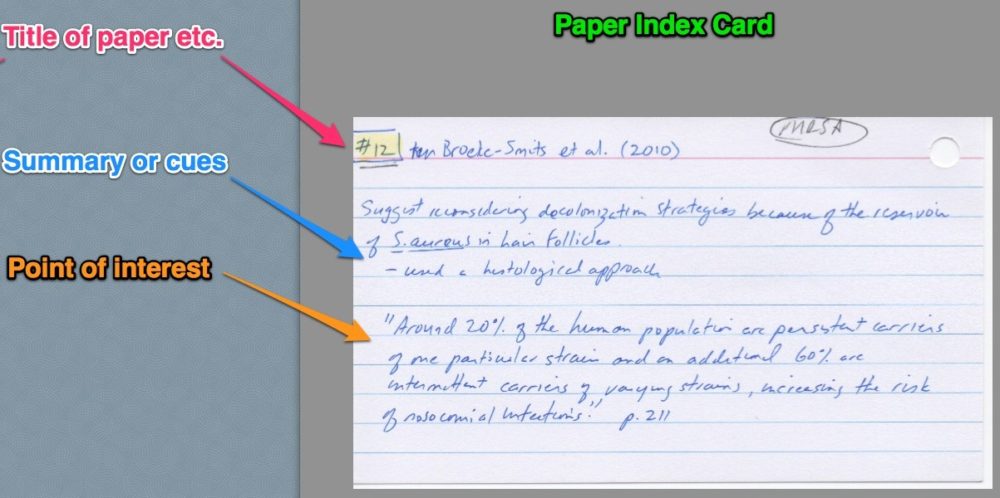

!!!! Below are some tips to help you avoid plagiarism. If you are a U of R Biology student, you must also read "Avoiding plagiarism: [A guide for students in the Biology Department at the University of Regina](http://urbiolabreports.wikidot.com/plagiarism-biology).

## Take good notes

The first step in avoiding using someone else's words as your own is to **take good notes**.

* Develop a [system](#paraphrasing-examples) for tracking all sources as you take your notes.

    * Record all bibliographic data and then write a paraphrase (or better yet, a [summary](http://writing.mit.edu/wcc/avoidingplagiarism)) of the information you plan on using from the source.
    * If you are recording the exact words, indicate this by using quotation marks and the page number(s).
    * If you are recording your thought based on what you have read, indicate it with *MINE*.

* Keep your assignment document close while you are reading and taking notes. When you are _done_ with your note-taking, open your assignment document.

## Make sure you UNDERSTAND the source

Reading and understanding primary literature can be a daunting task for those who are new to it. However, it is impossible to summarize information that you don't understand. For some useful tips on how to approach understanding scientific literature, please see [How to read and understand a scientific paper: a guide for non-scientists](http://violentmetaphors.com/2013/08/25/how-to-read-and-understand-a-scientific-paper-2/).

Start by looking up any words that you don't understand. Look for background information in a textbook or review article. You can even try Wikipedia, just remember that while Wikipedia is a good place to start, it should not be your final source. If you are still struggling to understand, try discussing the article with your instructor who has a lot of experience reading primary literature and may be able to clarify the material for you.

## Tips for paraphrasing

Start by making the statement that you need to support, and then, without looking at your source, summarize what the source said that supports your statement.

Remember to use simple words. The better your understanding, the better you will be at explaining complex ideas in simple terms. _This takes a lot of effort._

Avoid shortchanging yourself — and being caught plagiarizing — by using high school paraphrasing "techniques" and thinking these are acceptable at the university level:

* do not play the thesaurus game, aka including passages with a few altered words
* do not just rearrange the phrases of another author or paste together phrases from multiple authors.

Even if you cite the sources, the above strategies will still result in plagiarism.

## Give yourself enough time

Being rushed and under pressure makes you less likely to remember which words are yours and which are someone else's.

## When in doubt, cite

While it is possible to over-cite your sources, it is preferable to under-citing.

Your goal is to make sure the reader knows which thoughts are yours, and which are someone else's.

If you think something is [common knowledge](/academic-integrity/dept-guidelines#common-knowledge-statements) but you are not sure, cite!

## Quoting

You may be tempted to quote passages from your source. If you enclose these passages in quotation marks and include a citation, then you will **not** be guilty of plagiarism. However, science writers generally don't quote because they are expected to use other scientist's results and ideas, not the original author's words. It is the ideas and results that are important, and we use these to lend credence to our ideas or to compare and contrast with our results. When we rely on quotes, we are not adding any knowledge to the scientific community.  

There are three main reasons that students use quotes:

1.  they don't fully understand the passage they are reading, but think that something in it is important for understanding their study
2.  the passage they are reading uses a lot of fancy words or has a complex sentence structure that the student can't figure out how to paraphrase
3.  they feel that the quoted text best describes, in an eloquent way, the point that they are trying to make.

The solution to #1 is to determine how the information fits into your narrative. For example, does it help you explain why this study is important?  

The solution to #2 is to remind yourself that in science simple writing is better because complex writing makes it harder to understand the scientific importance of what you are trying to say.  

The solution to #3 is to describe your thoughts, hypotheses, or interpretations of the work you are citing rather than just presenting the original author's ideas.  

One strategy that might help you with all these problems is to first explain, out loud, to someone unfamiliar with what you are writing what the passage you are using means. Then, explain how this information fits with your study. Once you can explain it out loud, you should find it easier to write it out. If you don't have a willing audience, try recording yourself!

## Paraphrasing examples

**Genetics:**  
Detailed [paraphrasing examples](/academic-integrity/paraphrasing-examples) from a lab manual.

**Microbiology:**  
Original passage:

!!!! _Bacterial diseases are a continuing threat. Their general decline over the past century is probably due more to public health policies and education than to “wonder drugs”. A case in point is Lyme disease, currently the most widespread pest-carried disease in the United States._

From: Campbell, N. A. and J.B. Reece. 2002. Biology, 6th ed. Benjamin Cummings, San Francisco, CA.

A good paraphrase:

!!!! _Over the last century, the incidence of diseases due to bacterial infection has decreased. This reduction is likely not due to the development of "wonder drugs", but rather to improvements in education and public health policies (Campbell and Reece, 2002). The most common pest-borne disease in the US is Lyme disease (Campbell and Reece 2002)._

(This example is from an "[Avoiding Plagiarism Quiz](http://www.bio.ucalgary.ca/undergrad/plagiarism/plagiarismquiz.html)" from the University of Calgary.)

## Systems for tracking bibliography information

### Index Cards (or sticky notes)

* This is old-fashioned but very reliable.
* Record only one pertinent note (paraphrase, summary or quote) per card.
* Make sure you clearly identify the source on each card and record the full bibliographic information; you will need this information to correctly cite your source.
Advantage: When you are ready to organize your thoughts for writing, you can use the cards to physically lay out (group and order) how you will use the information.  

Disadvantage: Lots of handwriting.  

### Word processor program

Advantage: Most people already know how to use at least one of these and it is easy to cut and paste bibliographic information.  
Disadvantage: It is too easy to cut and paste direct quotes and _forget_ they are direct quotes. It can be hard to organize your thoughts when they are recorded in a single document in a linear fashion.

### [Papers](https://www.papersapp.com/)

* This is a program neither Lauri nor Heather could live without, but it might be overkill for most undergraduate students.
* In addition to storing bibliography information in a database, this program organizes your PDFs in an intuitive fashion (kind-of-like iTunes).
* Can be used to easily add citation and bibliography material to your paper (saves you some typing).
* You can easily take notes as you read.
* You can only look at the notes for the paper you are currently looking at, so to organize your notes will take some cutting and pasting.
* Up until recently this program only worked for Macs, but there is now a Windows version.
* Costs $79 (undergraduate students get a 40% discount).
* Has a very functional iPad/iPhone/Android app (costs extra).

### [Evernote](http://evernote.com/)

* This handy app works very well for organizing your notes in a database fashion.
* You can make notes, clip webpages and even add photos.
* Organize your notes in multiple ways using folders and tagging.
* Your notes are searchable.
* Works on Macs and PCs and has apps for most portable devices (i.e. you don't need to have your computer handy).
* Free](http://urbiolabreports.wdfiles.com/local--files/plagiarism/evernote.jpg)

### [Zotero](http://www.zotero.org/)

* Has both browser plugins and a stand alone version.
* The plugin usually recognizes when your browser is pointed at a citable source, and with a single click you can record the citation information.
* Citations are easy to organize (create multiple collections).
* You can add multiple notes to each citation (notes can be tagged).
* Attachments (such as PDFs) can be added to citations.
* Can clip and store full webpages (information you used will not be lost if the website changes).
* Always stores a link back to the page you were looking at.
* Has word processor plugins that can do most of your bibliography work for you.
* Free!

### Others?

* If you have a system you think others would find useful, tell us about it.