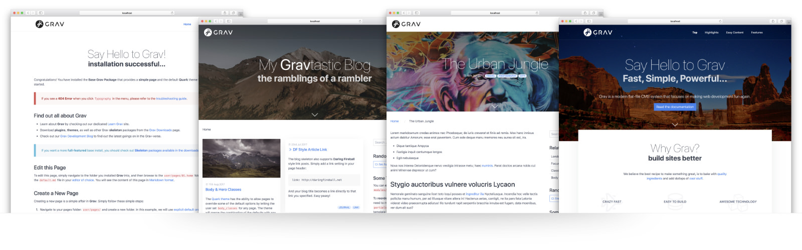

# Quark Theme



**Quark** is the new default theme for [Grav CMS](http://github.com/getgrav/grav).  This theme is built with the [Spectre.css](https://picturepan2.github.io/spectre/) framework and provides a powerful base for developing your own themes. Quark uses functionality that is only available in Grav 1.4+, as such you cannot run Quark on earlier versions of Grav.

## Features

* Lightweight and minimal for optimal performance
* Spectre CSS Framework
* Fully responsive with full-page mobile navigation
* SCSS based CSS source files for easy customization
* Built-in support for on-page navigation
* Multiple page template types
* Fontawesome icon support

### Supported Page Templates

* Default view template `default.md`
* Error view template `error.md`
* Blog view template `blog.md`
* Blog item view template `item.md`
* Modular view templates: `modular.md`
  * Features Modular view template `features.md`
  * Hero Modular view template `hero.md`
  * Text Modular view template `text.md`

# Installation

Installing the Quark theme can be done in one of two ways. Our GPM (Grav Package Manager) installation method enables you to quickly and easily install the theme with a simple terminal command, while the manual method enables you to do so via a zip file. 

The theme by itself is useful, but you may have an easier time getting up and running by installing a skeleton. The Quark theme can be found in both the [One-page](https://github.com/getgrav/grav-skeleton-onepage-site) and [Blog Site](https://github.com/getgrav/grav-skeleton-blog-site) which are self-contained repositories for a complete sites which include: sample content, configuration, theme, and plugins.

## GPM Installation (Preferred)

The simplest way to install this theme is via the [Grav Package Manager (GPM)](http://learn.getgrav.org/advanced/grav-gpm) through your system's Terminal (also called the command line).  From the root of your Grav install type:

    bin/gpm install quark

This will install the Quark theme into your `/user/themes` directory within Grav. Its files can be found under `/your/site/grav/user/themes/quark`.

## Manual Installation

To install this theme, just download the zip version of this repository and unzip it under `/your/site/grav/user/themes`. Then, rename the folder to `quark`. You can find these files either on [GitHub](https://github.com/getgrav/grav-theme-quark) or via [GetGrav.org](http://getgrav.org/downloads/themes).

You should now have all the theme files under

    /your/site/grav/user/themes/quark

## Default Options

Quark comes with a few default options that can be set site-wide.  These options are:

```yaml
enabled: true                 # Enable the theme
production-mode: true         # In production mode, only minified CSS is used. When disabled, nested CSS with sourcemaps are enabled
grid-size: grid-lg            # The max-width of the theme, options include: `grid-xl`, `grid-lg`, and `grid-md`
header-fixed: true            # Cause the header to be fixed at the top of the browser
header-animated: true         # Allows the fixed header to resize to a smaller header when scrolled
header-dark: false            # Inverts the text/logo to work better on dark backgrounds
header-transparent: false     # Allows the fixed header to be transparent over the page
sticky-footer: true           # Causes the footer to be sticky at the bottom of the page
blog-page: '/blog'            # The route to the blog listing page, useful for a blog style layout with sidebar
custom_logo:                  # A custom logo rather than the default (see below)  
custom_logo_mobile:           # A custom logo to use for mobile navigation
```

To make modifications, you can copy the `user/themes/quark/quark.yaml` file to `user/config/themes/` folder and modify, or you can use the admin plugin.

> NOTE: Do not modify the `user/themes/quark/quark.yaml` file directly or your changes will be lost with any updates

## Custom Logos

To add a custom logo, you should put the log into the `user/themes/quark/images/logo` folder.  Standard image formats are support (`.png`,`.jpg`, `.gif`, `.svg`, etc.).  Then reference the logo via the YAML like so:

```yaml
custom_logo:
    - name: 'my-logo.png'
custom_logo_mobile:
    - name: 'my-mobile-logo.png'    
```

Alternatively, you can you use the drag-n-drop "Custom Logo" field in the Quark theme options.

## Page Overrides

Quark has the ability to allow pages to override some of the default options by letting the user set `body_classes` for any page.  The theme will merge the combination of the defaults with any `body_classes` set. For example:

```yaml
body_classes: "header-dark header-transparent"
```

On a particular page will ensure that page has those options enabled (assuming they are false by default).

## Hero Options

The hero template allows some options to be set in the page frontmatter. This is used by the modular `hero` as well as the blog and item templates to provide a more dynamic header.

```yaml
hero_classes: text-light title-h1h2 parallax overlay-dark-gradient hero-large
hero_image: road.jpg
hero_align: center
```

The `hero_classes` option allows a variety of hero classes to be set dynamically these include:

* `text-light` | `text-dark` - Controls if the text should be light or dark depending on the content
* `title-h1h2` - Enforced a close matched h1/h2 title pairing
* `parallax` - Enables a CSS-powered parallax effect
* `overlay-dark-gradient` - Displays a transparent gradient which further darkens the underlying image
* `overlay-light-gradient` - Displays a transparent gradient which further lightens the underlying image
* `overlay-dark` - Displays a solid transparent overlay which further darkens the underlying image
* `overlay-light` - Displays a solid transparent overlay which further darkens the underlying image
* `hero-fullscreen` | `hero-large` | `hero-medium` | `hero-small` | `hero-tiny` - Size of the hero block

The `hero_image` should point to an image file in the current page folder.

## Features Modular Options

The features modular template provides the ability to set a class on the features, as well as an array of feature items.  For example:

```yaml
class: offset-box
features:
    - header: Crazy Fast
      text: "Performance is not just an afterthought, we baked it in from the start!"
      icon: fighter-jet
    - header: Easy to build
      text: "Simple text files means Grav is trivial to install, and easy to maintain"
      icon: database
    - header: Awesome Technology
      text: "Grav employs best-in-class technologies such as Twig, Markdown &amp; Yaml"
      icon: cubes
    - header: Super Flexible
      text: "From the ground up, with many plugin hooks, Grav is extremely extensible"
      icon: object-ungroup
    - header: Abundant Plugins
      text: "A vibrant developer community means over 200 themes available to download"
      icon: puzzle-piece
    - header: Free / Open Source
      text: "Grav is an open source project, so you can spend your money on other stuff"
      icon: money 
```

## Text Modular Options

The text box provides a single option to control if any image found in the page folder should be left or right aligned:

```yaml
image_align: right
```

